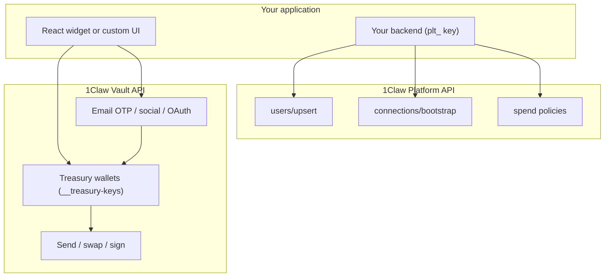

# Embedded Wallets Overview

1Claw **embedded wallets** give your end-users native, multi-chain crypto wallets inside your app — without browser extensions, seed phrases, or a separate wallet provider. Keys are generated in HSM-backed infrastructure, stored in a per-org `__treasury-keys` vault, and surfaced through passwordless auth plus an optional React widget.

This guide series covers the full embedded-wallet flow: platform setup, authentication, transactions, spend policies, React integration, fiat ramps, and advanced treasury features.

:::info Requirements
Embedded wallets require a **Pro or higher** plan for the [Platform API](/docs/platform-api/overview). Treasury wallets themselves are available on all tiers and count toward your org [wallet quota](/docs/treasury/overview).
:::

## What you get

| Capability | Description |
| ---------- | ----------- |
| **Passwordless auth** | Email OTP, Google/Apple/Discord social login, passkeys, and [Sign in with 1Claw](/docs/guides/embedded-wallets/authentication#sign-in-with-1claw-oauth) OAuth |
| **Multi-chain wallets** | Ethereum, Bitcoin, Solana, XRP, Cardano, Tron — one user, six addresses |
| **Send / swap / receive** | Native and token transfers, 0x DEX swaps, optional ERC-4337 gasless sends |
| **Spend policies** | App-level defaults and per-user overrides enforced before signing |
| **React widget** | [`@1claw/wallet-react`](/docs/treasury/wallet-react) — full UI or headless `useOneclawWallet()` |
| **Platform bootstrap** | Declarative templates provision vaults, agents, wallets, and policies per user |
| **Fiat ramps** | Coinbase Onramp and MoonPay widget URLs |
| **Audit & custody** | Hash-chained audit log, optional MPC and CMEK on paid tiers |

## Architecture

Embedded wallets sit on three layers:

1. **Your app** — Embeds `@1claw/wallet-react` or calls auth + treasury APIs from your frontend/backend.
2. **Platform API** — Your `plt_` key provisions users, bootstraps resources from templates, and sets spend policies. End-users authenticate with JWTs issued after OTP/social/OAuth login.
3. **Treasury wallets** — HSM-generated keys in `__treasury-keys` at `users/{user_id}/chains/{chain}/private_key`. Sends and swaps require human step-up (`X-Auth-Confirm` password or passkey tx token).

:::tip Custody guarantee
When you bootstrap with `platform_locked: true`, your platform operator account **cannot read** end-user secret values — only lifecycle operations (create, delete, rotate). See [Platform API — custody](/docs/platform-api/multi-tenant#custody-guarantee).
:::

## Embedded wallets vs agent signing keys

Both use strong cryptography, but they serve different principals:

| | **Embedded wallet (treasury)** | **Agent signing key** |
| --- | --- | --- |
| **Principal** | Human end-user | AI agent |
| **API access** | Human JWT only (`require_human`) | Agent JWT + Intents API |
| **Key storage** | `__treasury-keys` → `users/{id}/chains/...` | `__agent-keys` → `agents/{id}/chains/...` |
| **Typical use** | In-app Send/Swap/Receive for your users | Autonomous on-chain actions, Intents API |
| **Guardrails** | [Spend policies](/docs/guides/embedded-wallets/spend-policies) | [Transaction guardrails](/docs/agents/intents/guardrails) + policies |
| **Provisioning** | Auto on first login (`auto_provision_chains`) or `POST /v1/treasury/wallets/generate` | Human provisions via dashboard or `POST /v1/agents/{id}/signing-keys` |

Agents receive **403** on all treasury wallet endpoints. If your product needs programmatic signing for bots, provision [agent signing keys](/docs/agents/intents/multi-chain-signing) separately — often via [Platform bootstrap templates](/docs/guides/embedded-wallets/platform-api#bootstrap-templates).

## End-to-end user journey

1. **Developer** registers a platform app → receives `plt_` key.
2. **Developer** creates a bootstrap template (optional agents + policies) and embeds the wallet widget.
3. **End-user** signs in via email OTP or social login → treasury wallets auto-provision for requested chains.
4. **End-user** sends, swaps, or buys crypto — subject to your spend policies and step-up auth.
5. **Platform** receives webhooks (`platform.user.connected`, `wallet.transfer.sent`, etc.) if configured.

## Security & trust

Embedded wallet keys inherit 1Claw's envelope encryption, audit hash chain, and tier-aware HSM protection. For a deeper security picture:

- [Security overview](/docs/security/security-overview) — threat model, attestation, audit verification
- [Trust model comparison](/docs/security/trust-model-comparison) — whole-agent governance vs signing-only infrastructure
- [Migrate from Turnkey](/docs/integrations/migrate-from-turnkey) — mapping wallets and policies to 1Claw
- [Why 1Claw for embedded wallets](/docs/security/why-1claw-embedded-wallets) — platform positioning

## Guide map

| Guide | Topics |
| ----- | ------ |
| [Getting started](/docs/guides/embedded-wallets/getting-started) | Platform app, `plt_` key, bootstrap, claim flow |
| [Authentication](/docs/guides/embedded-wallets/authentication) | Email OTP, social login, passkeys, Sign in with 1Claw |
| [Multi-chain wallets](/docs/guides/embedded-wallets/multi-chain-wallets) | Six chains, generation, balances |
| [Send, swap, receive](/docs/guides/embedded-wallets/send-swap-receive) | Transfers, 0x swaps, gasless, passkey tx auth |
| [Spend policies](/docs/guides/embedded-wallets/spend-policies) | App defaults, per-user overrides |
| [React integration](/docs/guides/embedded-wallets/react-integration) | `@1claw/wallet-react` props and theming |
| [Platform API](/docs/guides/embedded-wallets/platform-api) | Upsert, bootstrap, templates, grants |
| [Fiat on/off ramps](/docs/guides/embedded-wallets/fiat-ramps) | Coinbase Onramp, MoonPay |
| [Advanced](/docs/guides/embedded-wallets/advanced) | Deposits, internal ledger, sub-orgs, CMEK/MPC |

## Quick links

- [2-minute quickstart](/docs/treasury/embedded-wallets) — minimal code sample
- [`@1claw/wallet-react` reference](/docs/treasury/wallet-react) — component API
- [Platform API overview](/docs/platform-api/overview) — full platform developer docs
- [Treasury wallets](/docs/treasury/overview) — underlying wallet system
