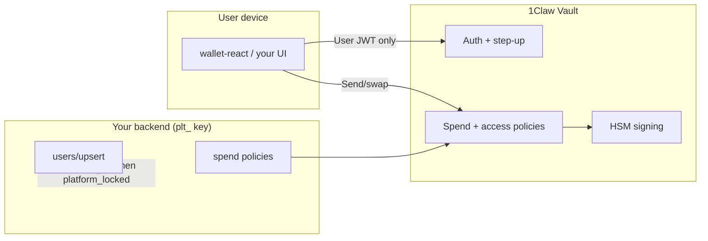

# Security and Custody

Embedded wallets inherit 1Claw's HSM-backed key hierarchy, envelope encryption, and audit hash chain. This page explains what your users' keys are protected by, what your platform can and cannot do, and how step-up auth fits in.

## Key storage model

| Layer | What it protects |
| ----- | ---------------- |
| **HSM / KMS** | Org KEK wraps per-secret DEKs; tier-aware HSM vs software protection |
| **`__treasury-keys` vault** | Per-org vault at `users/{user_id}/chains/{chain}/private_key` |
| **MPC (paid tiers)** | Pro/Team: XOR 2-of-2 client custody; Business/Enterprise: Shamir 2-of-3 multi-HSM |
| **Direct secret reads** | Blocked — keys are never returned via `GET /v1/vaults/.../secrets/...` |

Private keys are only exposed through:

- `POST /v1/treasury/wallets/{chain}/export` (password re-auth, audit-logged)
- Server-side signing on send/swap (user never sees the key)

:::info Agents cannot use treasury wallets
All treasury wallet endpoints enforce `require_human()`. Autonomous signing uses [agent signing keys](/docs/agents/intents/multi-chain-signing), not embedded treasury wallets.
:::

## Platform custody guarantee

When you bootstrap with **`platform_locked: true`**, your platform operator account can manage lifecycle (create, delete, rotate) but **cannot read** end-user secret values — including treasury private keys.

See [Platform API — custody](/docs/platform-api/multi-tenant#custody-guarantee).

## Enforcement layers for sends and swaps

Before any treasury wallet transaction is signed, the server evaluates guardrails in order:

1. **Human step-up** — `X-Auth-Confirm` (password) or `X-Passkey-Token` (WebAuthn bound to tx digest)
2. **[Spend policies](/docs/guides/embedded-wallets/spend-policies)** — app default + optional per-user override (`validate_wallet_send()`)
3. **[Wallet access policies](/docs/guides/embedded-wallets/wallet-access-policies)** — role/principal grants (Pro+; API live, runtime enforcement rolling out)
4. **Account lockout** — failed re-auth on export/send/swap increments lockout counter (10 failures → 15-minute lock)

Clients and widgets cannot bypass server-side checks — a blocked transaction never reaches signing.

## Authentication security

| Method | Notes |
| ------ | ----- |
| Email OTP | 5-minute TTL, auth-rate-limited (5 burst / 1 sec per IP) |
| Social login | Server-verified ID tokens; no email auto-linking (409 on conflict) |
| Sign in with 1Claw | PKCE (S256) required in production; RS256 ID tokens |
| Passkey tx auth | 5-minute token bound to `SHA256(chain\|to\|value_wei\|data)` |

See [Authentication](/docs/guides/embedded-wallets/authentication).

## Audit and compliance

- Every export, send, swap, and import is audit-logged (`treasury_wallet.*` events)
- Audit log uses hash-chained integrity (`integrity_hash`, `prev_event_id`)
- Verify org audit chain: `GET /v1/audit/verify` (org-scoped)

See [Audit and compliance](/docs/guides/audit-and-compliance) and [Security overview](/docs/security/security-overview).

## Enterprise options

| Feature | Tier | Purpose |
| ------- | ---- | ------- |
| CMEK | Business / Enterprise | Customer-managed AES layer; fingerprint only on server |
| Shamir org KEK | Business / Enterprise | Multi-HSM key encryption for org KEK |
| Sub-organizations | Enterprise | Per-tenant isolation under a parent org |

Details: [Advanced features](/docs/guides/embedded-wallets/advanced#cmek-and-mpc-custody).

## Threat model summary

**Your responsibilities as a platform developer:**

- Never ship `plt_` keys in frontend bundles — use `@1claw/wallet-react` or server-side Platform API calls
- Set spend policies before production
- Use HTTPS and secure OAuth redirect URIs
- Monitor webhooks for anomalous transfer patterns

## Related

- [Trust model comparison](/docs/security/trust-model-comparison)
- [HSM architecture](/docs/concepts/hsm-architecture)
- [Testing and production](/docs/guides/embedded-wallets/testing-production)
