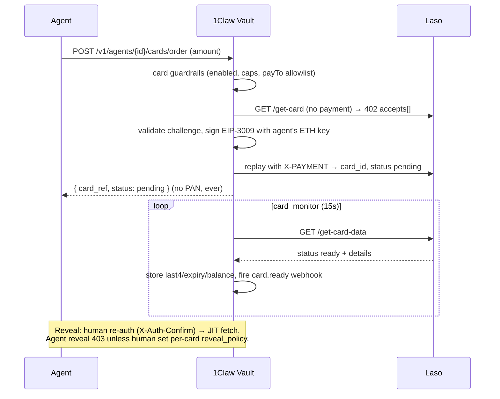

# Payment Card Vault

The Payment Card Vault lets an agent order a prepaid or gift card and pay for it with an outbound **x402** payment, signed with the agent's own Ethereum key. The agent never sees the card number (PAN) or CVV. Humans reveal card details on demand, gated by password re-authentication.

:::tip Security model
- **Agents never see PANs by default.** Card details are fetched just-in-time from the issuer at reveal, or stored encrypted for manually-imported cards.
- **x402 challenges are validated before signing.** The Vault only ever signs a Base USDC transfer to an allowlisted recipient, for the exact amount requested.
- **Ordering guardrails bound the purchase, not the spend.** Once a card is revealed, it can be used anywhere up to its balance — 1Claw has no further control.
- **Pro+ tier** required to enable card ordering per agent.
:::

## How it works



## Prerequisites

1. The agent has an Ethereum signing key: `POST /v1/agents/{id}/signing-keys { "chain": "ethereum" }`.
2. That signing-key address holds USDC on **Base mainnet** (fund it via a treasury send, deposit destination, or external transfer).
3. Card ordering is enabled on the agent (Pro+).

## Enable card ordering on an agent

In the dashboard, open the agent's **Signing** tab and turn on **Card Ordering Guardrails**. Set the caps that bound spend:

- **Max order (USD)** — per-order cap.
- **Daily limit (USD)** — rolling 24-hour cumulative cap (enforced atomically).
- **payTo allowlist** — allowed x402 recipients (leave empty to use the built-in Laso Base recipient).
- **Agent reveal** — whether agents may reveal cards, subject to a per-card reveal policy (default off).

Via the SDK:

```typescript
await client.agents.update(agentId, {
  cards_enabled: true,
  card_max_order_usd: "100",
  card_daily_limit_usd: "500",
});
```

## Order a card

The order is paid via x402 automatically; you never touch the payment header. An `Idempotency-Key` is generated for you, so a retry after a timeout never double-orders.

```typescript
const { data: card } = await client.cards.order(agentId, {
  kind: "prepaid",
  amount_usd: "25.00",
});
// card.status === "pending" — no PAN is ever returned here
```

CLI:

```bash
1claw card order --agent <agent-id> --amount 25.00
```

The response is always **masked** — you get a card reference, status, and (once ready) `last4`, expiry, and balance, never the full number.

## Order a gift card

```typescript
const { data: brands } = await client.cards.searchGiftCards({ query: "amazon" });
const { data: card } = await client.cards.order(agentId, {
  kind: "gift_card",
  amount_usd: "50.00",
  laso_server_id: brands /* pick a server id from the results */,
});
```

Gift-card redemption details (URL, code, PIN) are stored securely and surfaced through the same reveal gating as a PAN.

## Track status

A background monitor polls the issuer and updates the card as it becomes ready. Register a webhook to react to lifecycle events:

`card.ordered`, `card.ready`, `card.revealed`, `card.voided`, `card.depleted`, `card.orphaned_payment`.

```typescript
const { data: cards } = await client.cards.list(); // all masked to last4
const { data: card } = await client.cards.get(cardId);
```

## Reveal card details

Revealing full details requires a human to re-authenticate with their account password (sent as `X-Auth-Confirm`). Every reveal is audit-logged.

```typescript
const { data } = await client.cards.reveal(cardId, { password: "your-password" });
// { pan, cvv, exp_month, exp_year, disclaimer }
```

Agents can only reveal when a human has enabled a per-card reveal policy (single-use, with an optional TTL):

```typescript
await client.cards.update(cardId, {
  agent_reveal: true,
  max_reveals: 1,
  reveal_expires_at: "2026-12-31T00:00:00Z",
});
```

:::warning Post-reveal disclaimer
Once revealed, this card can be used anywhere up to its balance — 1Claw has no further control. Ordering guardrails bound the purchase, not the spend.
:::

## Void and refresh

```typescript
await client.cards.void(cardId);    // 1Claw-level lock (forward-looking only)
await client.cards.refresh(cardId); // pull latest balance/status from the issuer
```

Void is a 1Claw-level lock that blocks all further reveals and refreshes. It does **not** cancel a card already revealed to someone — that card remains live. Refresh is rate-limited; if you refresh too often you get a clean `429` with a `Retry-After` header.

## Manually import a card

Humans can import an existing card into full encrypted storage. The PAN is stored as an encrypted secret and the CVV is one-time-read (returns `410 Gone` after the first read).

```typescript
await client.cards.import({
  pan: "4111111111111111",
  cvv: "123",
  exp_month: 12,
  exp_year: 2028,
  brand: "visa",
});
```

## MCP tools

Agents using MCP get `order_card`, `order_gift_card`, `search_gift_cards`, `list_cards`, and `get_card_status`. Reveal is intentionally **not** an MCP tool — it would place a live PAN in the model's context window. Reveal only via the dashboard, SDK, or CLI with password re-authentication.

## PCI note

For issuer-backed cards, 1Claw runs in "reference mode" — it stores only the issuer's card id and an encrypted refresh token, and fetches the PAN/CVV just-in-time at reveal, keeping raw card numbers out of long-term storage. Manually imported cards use full encrypted storage; discuss this mode with a QSA before relying on it for compliance. The dashboard and audit log always mask to `last4`.
