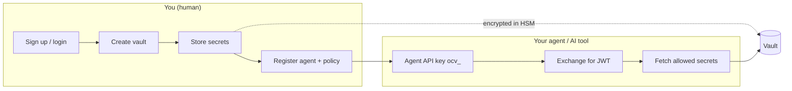

# Quickstart

Get from zero to a working integration in a few minutes. **Start with the CLI** if you want the fastest path — one command provisions a vault, agent, access policy, and wires your AI tools (Cursor, Claude Desktop, VS Code, and more).

:::tip Fastest path — recommended
Install the CLI and run **`1claw setup`**. It logs you in, creates an agent + vault + policy, and configures MCP for every AI client it detects. No manual curl, no copy-pasting API keys into config files.

```bash
brew install 1clawAI/tap/oneclaw   # or: npm install -g @1claw/cli
1claw setup
```

When setup finishes, your AI assistant can call 1Claw tools (`get_secret`, `list_secrets`, and more) at runtime — secrets stay in the vault, not in prompts or `.env` files. See the [CLI guide](/docs/guides/cli) for all options (`--client cursor`, `--local`, existing agent keys).
:::

## How 1Claw works

1Claw has two roles. **Humans** own secrets and decide what agents can access. **Agents** fetch secrets at runtime through scoped, audited policies — they never get blanket vault access.



| Role | You are… | You do… | Auth |
| ---- | -------- | ------- | ---- |
| **Human** | Developer, operator, or team owner | Create vaults, store secrets, register agents, write policies | Email/password, Google, passkey, or personal API key (`1ck_`) |
| **Agent** | AI assistant, service, or automation | List and fetch secrets the human allowed; optionally sign txs or route LLM calls through Shroud | Agent API key (`ocv_`) → short-lived JWT |

Same API for both: `https://api.1claw.xyz`. The dashboard at [1claw.xyz](https://1claw.xyz) is a UI on top of the same endpoints.

---

## Pick your path

| Goal | Fastest route | Steps |
| ---- | ------------- | ----- |
| **AI assistant with vault access** (Cursor, Claude, etc.) | [`1claw setup`](#fastest-cli-setup) | 1 command |
| **Store secrets as a human** (scripts, apps, CI) | [Human path](#human-path-store-and-use-secrets) | 3–4 steps |
| **Agent fetching secrets** (service, LangChain, custom code) | [Agent path](#agent-path-fetch-secrets-at-runtime) | 2–4 steps |
| **Human grants agent access end-to-end** | [Golden path](/docs/guides/give-agent-access) or `1claw setup` | 4 steps |
| **No cloud / offline secrets** | `1claw init --docker --local` or [local vault](/docs/guides/cli#local-vault-offline-encrypted) | See [CLI](/docs/guides/cli) |

---

## Fastest: CLI setup

**Best for:** Cursor, Claude Desktop, Claude Code, VS Code, Windsurf, Zed, Continue — any tool that supports MCP.

```bash
brew install 1clawAI/tap/oneclaw
1claw setup
```

What `setup` does in one flow:

1. **Login** — browser device flow at [1claw.xyz](https://1claw.xyz) (no password in terminal)
2. **Provision** — agent (Shroud + Intents enabled), vault, and read/write policy on `secrets/*`
3. **Configure** — writes MCP config for each detected AI client

**Already have an agent key?** Skip provisioning:

```bash
1claw setup --agent-key ocv_YOUR_KEY
```

**Import existing `.env` secrets:**

```bash
1claw login
1claw vault create my-vault          # or use default from setup
1claw import .env --vault <vault-id>
```

**Run a command with secrets injected (CI/CD):**

```bash
export ONECLAW_TOKEN="..."           # or ONECLAW_API_KEY + ONECLAW_VAULT_ID
1claw env run -- npm start
```

Full command reference: [CLI guide](/docs/guides/cli).

---

## Human path: store and use secrets

**You own the vault.** Sign up, create a vault, store a secret, read it back.

### Option A — CLI (fewest steps)

```bash
1claw login
1claw vault create "My Vault"
1claw secret set api-keys/openai --value "sk-proj-..." --type api_key
1claw secret get api-keys/openai
```

### Option B — Dashboard

1. Sign up at [1claw.xyz](https://1claw.xyz)
2. **Vaults → Create vault** (or use the [onboarding wizard](https://1claw.xyz/onboarding))
3. **Secrets → Add secret** at a path like `api-keys/openai`
4. Optional: **Agents → Register agent** and **Policies → Grant access**

### Option C — REST API / SDK

Step-by-step curl, TypeScript, and Python examples: [Quickstart for humans](/docs/quickstart/humans).

---

## Agent path: fetch secrets at runtime

**An agent only sees what a human allowed.** Zero access by default until a policy grants specific paths.

### How an agent gets credentials

| Method | Who initiates | When to use |
| ------ | ------------- | ----------- |
| **Human registers agent** | You in dashboard or `1claw agent create` | You control provisioning; share `ocv_` key once |
| **Self-enrollment** | Agent calls `POST /v1/agents/enroll` | Agent-first flows; human approves via email or link |
| **`1claw setup`** | CLI during setup | Fastest when wiring an AI client |

### Minimal agent flow (already have `ocv_` key)

```bash
# Exchange key for JWT (CLI handles refresh automatically in scripts)
1claw agent token <agent-id>

# Or with curl — see full guide
curl -X POST https://api.1claw.xyz/v1/auth/agent-token \
  -H "Content-Type: application/json" \
  -d '{"api_key":"ocv_..."}'
```

Then list and fetch secrets the policy allows (metadata vs decrypted value):

```bash
1claw secret list --vault <vault-id>    # as agent: set ONECLAW_AGENT_API_KEY
```

Full walkthrough (enroll, token, list, fetch, share back): [Quickstart for agents](/docs/quickstart/agents).

:::info Policies are the gate
An agent with an API key but **no policy** gets **zero secrets**. After creating an agent, always add a policy (dashboard, `1claw policy create`, or let `1claw setup` do it). See [Give an agent access](/docs/guides/give-agent-access).
:::

---

## Ways to integrate

Choose the interface that matches where your code runs:

| Integration | Best for | Get started |
| ----------- | -------- | ----------- |
| **[CLI](/docs/guides/cli)** | Fastest onboarding, CI/CD, `env run`, local daemon | `1claw setup` |
| **[Dashboard](https://1claw.xyz)** | Visual setup, policies, audit log, billing | Sign up → onboarding wizard |
| **[MCP Server](/docs/mcp/overview)** | AI assistants (Claude, Cursor, GPT) calling vault tools | `1claw setup` or [MCP setup](/docs/mcp/setup) |
| **[TypeScript SDK](/docs/sdks/javascript)** | Node.js apps, agents, platform backends | `npm install @1claw/sdk` |
| **[REST API](/docs/reference/api-reference)** | Any language, curl, Postman | [Human](/docs/quickstart/humans) or [Agent](/docs/quickstart/agents) quickstart |
| **[Shroud proxy](/docs/guides/shroud)** | LLM traffic — redaction, injection detection, vault-backed provider keys | `1claw proxy` or agent with Shroud enabled |
| **[Intents API](/docs/guides/intents-api)** | On-chain signing without exposing private keys | Enable on agent → `1claw agent tx submit` |
| **Local vault + daemon** | Offline dev, secret never in model context | `1claw local init` → `1claw setup --local` |
| **Docker agent runtime** | Isolated agent in a container, chat UI on :3000 | `1claw init --docker` |

### Common integration patterns

**1. AI coding assistant (recommended)**

```bash
1claw setup --client cursor    # or omit --client for all detected tools
```

Agent uses MCP tools at runtime; you manage secrets in the vault via dashboard or CLI.

**2. Application / backend service**

Use the SDK or REST API with a personal API key (`1ck_`) for human operations, or an agent key (`ocv_`) for automated fetch. See [JavaScript SDK](/docs/sdks/javascript).

**3. CI/CD pipeline**

```bash
export ONECLAW_TOKEN="${{ secrets.ONECLAW_TOKEN }}"
1claw env pull -o .env.production
npm run deploy
```

**4. LLM app with guardrails**

Enable Shroud on the agent, store provider keys in the vault, point requests at `https://shroud.1claw.xyz`. See [Shroud](/docs/guides/shroud) and [IDE setup](/docs/guides/ide-shroud-setup).

**5. On-chain agent**

Enable Intents API, provision signing keys, set transaction guardrails in the dashboard. See [Intents API](/docs/guides/intents-api).

---

## End-to-end in four steps (human + agent)

The shortest manual path if you are not using `1claw setup`:

1. **Sign up** — [1claw.xyz](https://1claw.xyz) or `1claw login`
2. **Vault + secret** — `1claw vault create` + `1claw secret set …` (or dashboard)
3. **Agent + policy** — `1claw agent create my-agent` + `1claw policy create …` (or [golden path guide](/docs/guides/give-agent-access))
4. **Connect** — MCP via `1claw setup`, SDK in your app, or `1claw agent token` + API calls

---

## Prerequisites

| Requirement | Details |
| ----------- | ------- |
| **Account** | Free tier at [1claw.xyz](https://1claw.xyz) — 1,000 requests/month, 3 vaults, 2 agents |
| **CLI** | Node 20+ for `npm install -g @1claw/cli`, or Homebrew tap above |
| **API base URL** | `https://api.1claw.xyz` |
| **curl / HTTP client** | Only needed if you skip the CLI and follow the REST quickstarts |

---

## Next steps

- [Quickstart for humans](/docs/quickstart/humans) — REST/SDK vault CRUD in detail
- [Quickstart for agents](/docs/quickstart/agents) — enroll, token exchange, fetch secrets
- [Give an agent access](/docs/guides/give-agent-access) — golden path with policies
- [Parts of 1Claw](/docs/concepts/parts-of-1claw) — Vault, Shroud, Intents, and all interfaces
- [CLI](/docs/guides/cli) — full command reference, Docker runtime, local daemon
- [MCP overview](/docs/mcp/overview) — tools your AI assistant can call
- [Examples repo](https://github.com/1clawAI/1claw-examples) — Basic and LangChain samples
