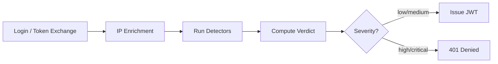

# Risk Engine

The 1Claw Risk Engine evaluates every authentication event in real-time, scoring risk based on geo-velocity, behavioral baselines, and canary secrets. High-risk verdicts block token issuance; critical verdicts revoke all active sessions immediately.

---

## How It Works



1. **Enrichment** — Client IP is resolved to geo-location, ASN, and ISP via MaxMind GeoLite2
2. **Detectors** — Pure functions that evaluate the enriched context against historical baselines
3. **Scoring** — Max-of-reasons strategy produces a severity (low → critical) and numeric score
4. **Verdict gate** — High or critical verdicts block the authentication request

---

## Detectors

### Geo-Velocity (Impossible Travel)

Detects when a principal authenticates from two locations that are physically impossible to traverse in the elapsed time. Uses Haversine distance and a configurable speed threshold (900 km/h default, with VPN ASN allowlist).

| Condition | Severity |
|-----------|----------|
| Speed > 900 km/h, different country | High |
| Speed > 900 km/h, same country | Medium |

### First-Seen (Baseline Drift)

Flags authentication from an ASN, country, or device that the principal has never used before. Baselines are built incrementally — each successful auth updates the principal's fingerprint.

| Condition | Severity |
|-----------|----------|
| New ASN (never seen) | Medium |
| New country (never seen) | Medium |
| New device ID | Low |

### Honeytoken (Canary Secrets)

When a principal reads a secret that has been marked as a honeytoken, a **critical** verdict is recorded. The current request is NOT blocked (to avoid tipping off the attacker), but their next authentication attempt will be denied.

| Condition | Severity |
|-----------|----------|
| Honeytoken secret accessed | Critical |

---

## Honeytokens

Honeytokens are decoy secrets placed in vaults to detect compromise. Create them via the Dashboard, API, or SDK.

### Dashboard

Navigate to **Risk Engine → Honeytokens** to create and manage honeytokens.

### API

```bash
# Create a honeytoken
curl -X POST https://api.1claw.xyz/v1/risk/honeytokens \
  -H "Authorization: Bearer $TOKEN" \
  -H "Content-Type: application/json" \
  -d '{"vault_id": "...", "secret_path": "api-keys/production", "notes": "Canary for vault breach"}'

# List honeytokens
curl https://api.1claw.xyz/v1/risk/honeytokens \
  -H "Authorization: Bearer $TOKEN"
```

### SDK

```typescript
// Create a honeytoken
await client.risk.createHoneytoken({
  vault_id: "vault-uuid",
  secret_path: "credentials/aws-root",
  notes: "High-value canary"
});

// List honeytokens
const { honeytokens } = await client.risk.listHoneytokens();
```

### Best Practices

- Place honeytokens at paths that look valuable: `api-keys/production`, `credentials/aws-root`
- Use at least one per vault in high-security environments
- Monitor the Risk Engine dashboard for triggered honeytokens
- A triggered honeytoken means confirmed unauthorized access

---

## DPoP Token Binding (RFC 9449)

DPoP (Demonstration of Proof-of-Possession) binds JWTs to a client-generated keypair. Even if a JWT is stolen, it cannot be used without the matching private key.

### How It Works

1. Client generates an ephemeral P-256 keypair
2. During token exchange, client sends `dpop_jwk` (public key) in the request body
3. Server computes the JWK SHA-256 thumbprint and embeds it as `cnf.jkt` in the JWT
4. On every subsequent request, client sends a signed `DPoP` proof header
5. Server verifies the proof signature matches the `cnf.jkt` in the JWT

### SDK Usage

```typescript
const client = new OneclawClient({
  apiKey: "ocv_...",
  dpop: true, // Enable DPoP proof-of-possession
});
```

### MCP / CLI

```bash
export ONECLAW_DPOP=true
```

### Org Enforcement

Administrators can configure DPoP enforcement per org:

| Mode | Behavior |
|------|----------|
| `off` | DPoP not required (default) |
| `warn` | Log when DPoP is missing, but allow |
| `required` | Reject requests without valid DPoP proof |

Configure via **Settings → Security → DPoP Token Binding** in the dashboard.

---

## Continuous Access Evaluation (CAE)

When the Risk Engine produces a **critical** verdict (e.g., honeytoken accessed), all active tokens for that principal are immediately revoked:

1. All entries in `jwt_bound_keys` are marked revoked
2. All entries in `agent_active_tokens` are deleted (for agents)
3. JTIs are inserted into `revoked_tokens` for immediate enforcement
4. The principal's next request fails authentication

### Recovery

Verdicts expire automatically after **15 minutes** (`expires_at` on the verdict record). After expiry, the principal can authenticate again unless a new high/critical event refreshes the verdict.

**Honeytoken / critical verdict caveat:** A triggered honeytoken creates a **critical** verdict that revokes all active sessions (CAE). The 15-minute TTL applies to the verdict itself — not to any manual investigation you still need to do. If an attacker may still hold exfiltrated credentials, treat honeytoken triggers as **confirmed compromise**: rotate affected secrets, review audit logs, and consider keeping the principal blocked until an admin clears the incident (manual verdict review / re-auth hardening is a planned product improvement).

Administrators can inspect active verdicts via the Risk Engine dashboard or `GET /v1/risk/verdicts`.

---

## Risk Events & Verdicts API

### List Risk Events

```bash
GET /v1/risk/events?severity=high&limit=50
```

### Get Verdict for a Principal

```bash
GET /v1/risk/verdicts/user/{user_id}
GET /v1/risk/verdicts/agent/{agent_id}
```

### Dashboard

Navigate to **Risk Engine** in the sidebar to view:
- Real-time risk events feed with severity filtering
- Active verdicts with principal details
- Honeytoken management (create, list, delete)

---

## Configuration

The Risk Engine requires no configuration to activate — it runs automatically on every authentication event. Optional configuration:

| Setting | Description |
|---------|-------------|
| MaxMind GeoLite2 | Bundled in Docker image; gracefully degrades without it |
| DPoP enforcement | Org setting: off / warn / required |
| Honeytokens | Create via dashboard or API to enable canary detection |
